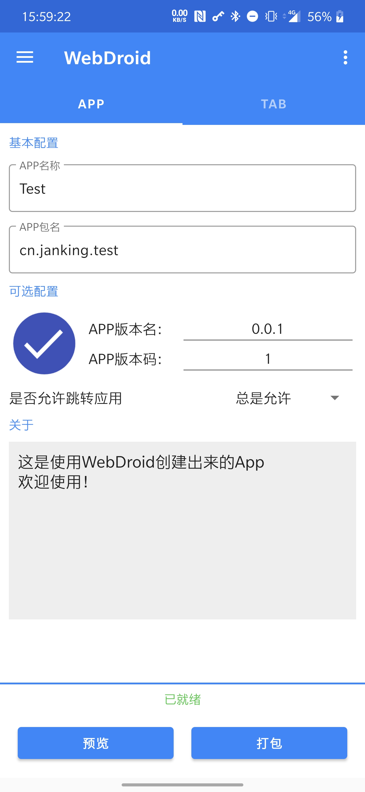
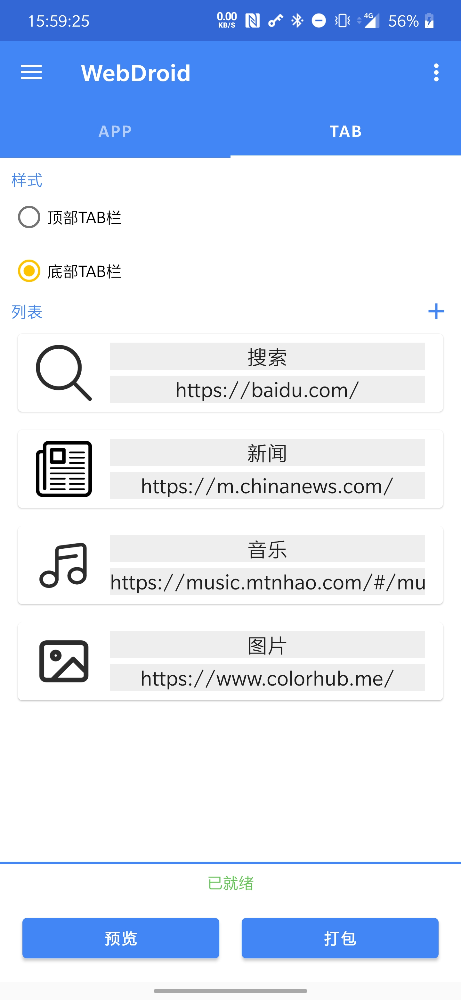
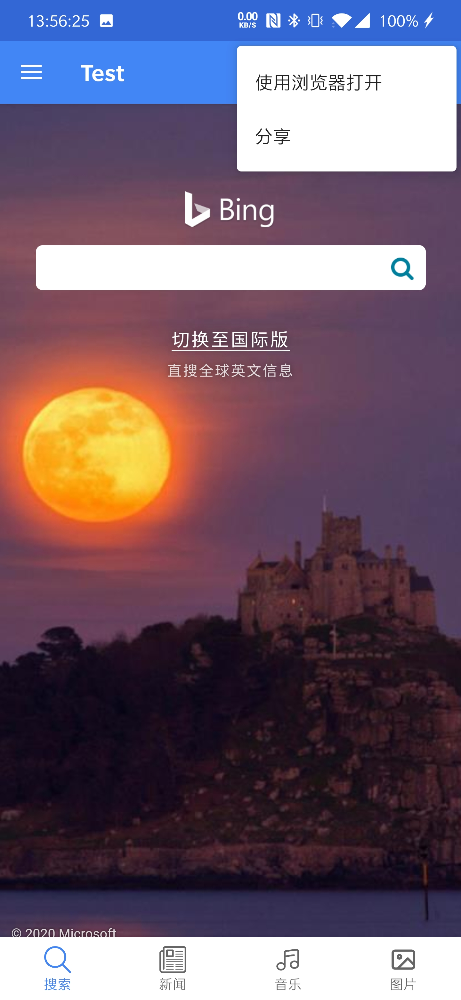
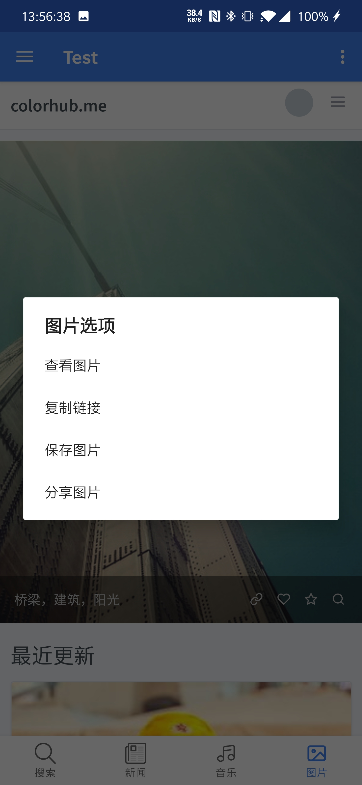

## WebDroid
一个简单的Android端混合应用（Hybrid App）生成器，能够把网页打包成APK

### 效果图

    
    

### 注意

* 下载[RELEASE安装包](https://github.com/JankingWon/WebDroid/releases)直接安装或导入工程使用
* **本应用**支持 Android7.0 至 Android9.0 使用
* **生成的应用**支持 Android5.0 至 Android10.0使用
